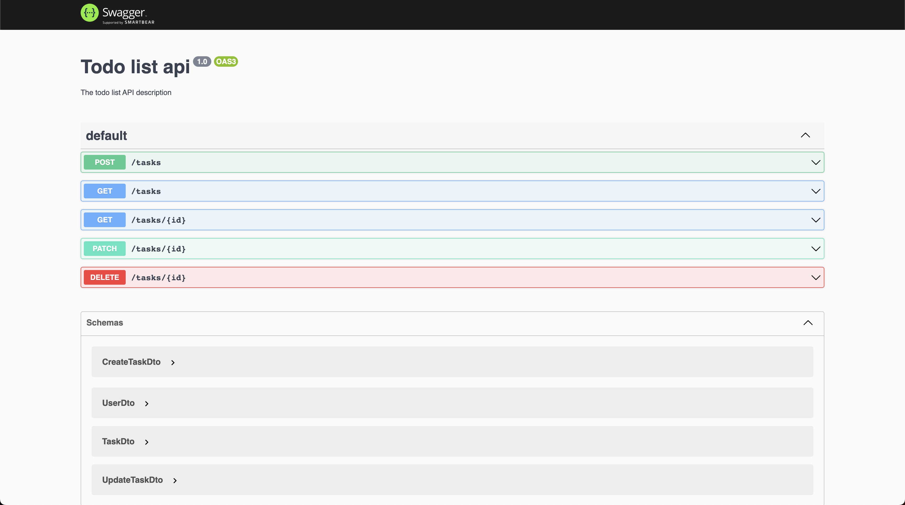

## Backend for the [interview assignment](https://github.com/stark-tech-space/interview-todoList)

## Tech stack
Typescript + NestJs + TypeORM + Postgres + Docker

## Installation

```bash
$ yarn install
```

## Build Docker

```bash
$ docker build . -t todo-list:latest
```

## Running the app

```bash
$ docker compose up
```

## API doc

#### Database ER Diagram


#### Open API/Swagger doc

http://localhost:3000/api


Create task
```bash
curl -X 'POST' \
  'http://localhost:3000/tasks' \
  -H 'accept: application/json' \
  -H 'Content-Type: application/json' \
  -d '{
  "creatorId": 1,
  "title": "abc",
  "description": "def",
  "expireAt": "2023-03-12T17:09:22.045Z"
}'
```

List task
```bash
curl -X 'GET' \
  'http://localhost:3000/tasks?creatorId=1&orderBy=id&direction=asc' \
  -H 'accept: application/json'
```

Get task by id
```bash
curl -X 'GET' \
  'http://localhost:3000/tasks/1' \
  -H 'accept: application/json'
```

Update a task
```bash
curl -X 'PATCH' \
  'http://localhost:3000/tasks/1' \
  -H 'accept: */*' \
  -H 'Content-Type: application/json' \
  -d '{
  "title": "123",
  "description": null,
  "expireAt": "2023-03-18T00:00:00.000Z"
}'
```

Delete task by id
```bash
curl -X 'DELETE' \
  'http://localhost:3000/tasks/1'
```